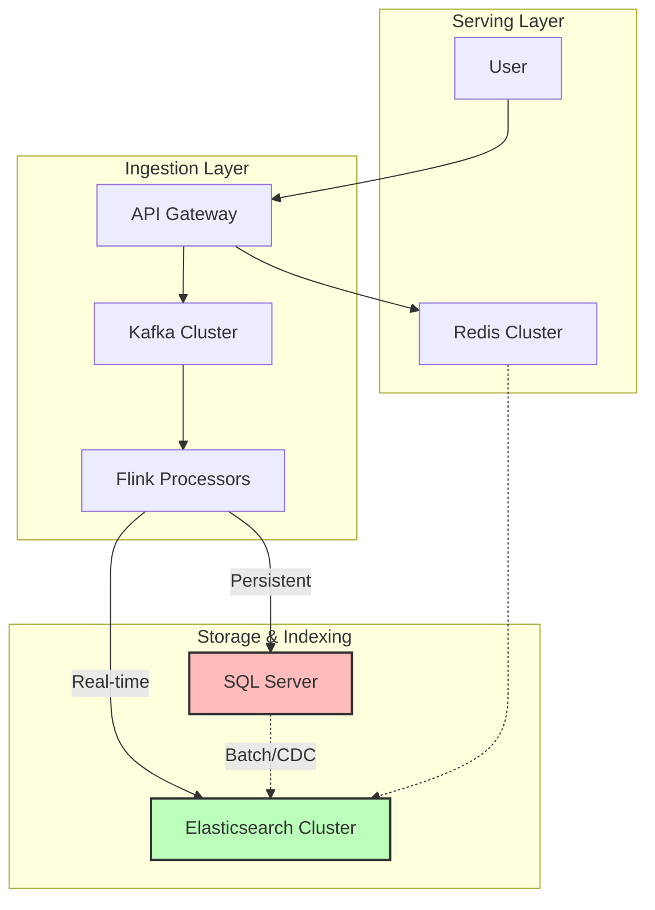

# خلاصه فنی پروژه موتور جستجوی اینستاگرام (نسخه مشاوره)

> [!NOTE]
> این سند برای ارائه در جلسه مشاوره فنی آماده شده است و تمرکز آن بر معماری، انتخاب تکنولوژی و نقاط کلیدی تصمیم‌گیری است.

## 1. نمای کلی پروژه (Project Snapshot)

هدف: ساخت یک موتور جستجوی Enterprise برای دیتای اینستاگرام.

| معیار (Metric) | هدف (Target) | توضیح |
| :--- | :--- | :--- |
| **Scale** | **100M+ Documents** | قابلیت جستجو در صدها میلیون پست |
| **Latency** | **< 300ms** | پاسخدهی سریع (P95) |
| **Throughput** | **10,000 QPS** | تحمل بار بالا |
| **Freshness** | **< 30s** | ایندکس شدن پست‌های جدید در کمتر از ۳۰ ثانیه |

---

## 2. معماری کلان (High-Level Architecture)

ما از یک معماری **Lambda** استفاده می‌کنیم تا هم Real-time باشیم و هم Consistency داشته باشیم.

---

## 3. تکنولوژی‌های کلیدی (Tech Stack Decisions)

چرا این تکنولوژی‌ها را انتخاب کردیم؟ (نیاز به تایید مشاور)

| تکنولوژی | نقش | دلیل انتخاب | جایگزین‌های رد شده |
| :--- | :--- | :--- | :--- |
| **Elasticsearch** | Search Engine | Native Full-text, Vector Support, Scale | Solr (کندتر), Algolia (گران/محدود) |
| **SQL Server** | Source of Truth | ACID Transactions, CDC Support, Team Skill | PostgreSQL (تیم دات‌نت هستیم) |
| **Kafka** | Message Broker | Decoupling, Durability, Replay capability | RabbitMQ (Scale پایین‌تر) |
| **Apache Flink** | Stream Processing | Stateful processing, Low latency, Exactly-once | Spark Streaming (Micro-batch latency) |
| **Redis** | Caching | Sub-ms latency, Distributed locking | Memcached (Feature کمتر) |

---

## 4. استراتژی‌های مهم پیاده‌سازی (Critical Implementation Details)

### الف) Sharding Strategy
- **تعداد Shards**: ۱۸ عدد (برای ۵۰۰ گیگابایت دیتا).
- **سایز هر Shard**: حدود ۲۷ گیگابایت (Optimal range: 10-50GB).
- **سوال برای مشاوره**: آیا با توجه به رشد دیتا، ۱۸ شارد برای شروع مناسب است یا باید Over-sharding کنیم؟

### ب) Hybrid Search (BM25 + Vector)
ترکیب جستجوی کلمات کلیدی و معنایی:
- **BM25 (30%)**: برای تطبیق دقیق کلمات (Exact Match).
- **Vector (25%)**: برای درک معنایی (Semantic) با مدل `all-MiniLM-L12-v2`.
- **Engagement (20%)**: لایک و کامنت.
- **Recency (15%)**: تازگی محتوا.
- **Authority (10%)**: اعتبار اکانت.

### ج) Learning to Rank (LTR)
استفاده از مدل **LambdaMART** برای بازچینی (Re-ranking) نتایج نهایی.
- **روش**: استخراج فیچرها از ۱۰۰ نتیجه اول و مرتب‌سازی مجدد با مدل ML.
- **سوال برای مشاوره**: آیا هزینه Performance مدل LTR برای ۱۰,۰۰۰ QPS توجیه‌پذیر است؟

---

## 5. سوالات کلیدی برای جلسه مشاوره (Consultation Points)

این‌ها نقاطی هستند که بیشترین ریسک یا ابهام را دارند و نیاز به نظر متخصص داریم:

1.  **Sharding & Scaling**:
    - آیا استراتژی ۱۸ شارد برای ۱۰۰ میلیون داکیومنت کافی است؟ اگر به ۵۰۰ میلیون برسیم، Re-indexing چقدر دردسر دارد؟ آیا ILM (Index Lifecycle Management) به تنهایی کافی است؟

2.  **Real-time Indexing (Flink vs Spark)**:
    - ما Flink را انتخاب کردیم چون True Streaming است. آیا پیچیدگی نگهداری Flink نسبت به Spark Streaming ارزشش را دارد؟

3.  **Vector Search Performance**:
    - استفاده از HNSW با `m=16` و `ef_construction=100`. آیا این تنظیمات برای Scale ما مناسب است یا Memory Overhead زیادی ایجاد می‌کند؟ آیا `int8 quantization` دقت را خیلی پایین نمی‌آورد؟

4.  **SQL Server CDC**:
    - آیا CDC روی SQL Server با حجم دیتای بالا (High Write Throughput) باعث کندی دیتابیس اصلی نمی‌شود؟

5.  **Hardware Sizing**:
    - برای کلاستر Elasticsearch چه مشخصات سخت‌افزاری (RAM/CPU) پیشنهاد می‌شود تا Latency زیر ۳۰۰ میلی‌ثانیه تضمین شود؟

---

> [!TIP]
> **خروجی مورد انتظار از جلسه**: تایید معماری فعلی یا پیشنهاد تغییرات حیاتی قبل از شروع پیاده‌سازی سنگین.
