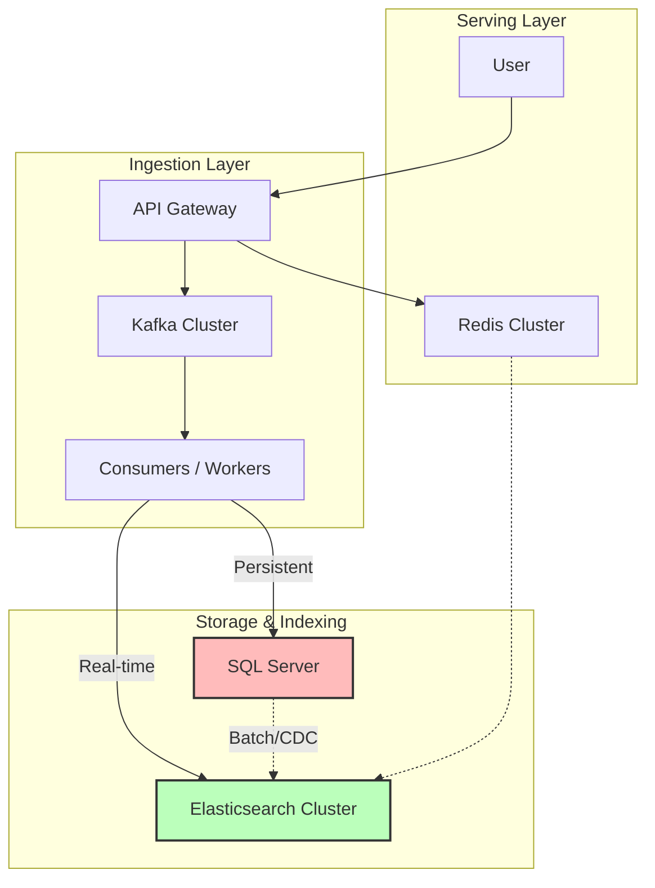

# خلاصه فنی پروژه موتور جستجوی اینستاگرام (نسخه مشاوره)

> [!NOTE]
> این سند برای ارائه در جلسه مشاوره فنی آماده شده است و تمرکز آن بر معماری، انتخاب تکنولوژی و نقاط کلیدی تصمیم‌گیری است.

## 1. نمای کلی پروژه (Project Snapshot)

هدف: ساخت یک موتور جستجوی Enterprise برای دیتای اینستاگرام.

| معیار (Metric) | وضعیت فعلی | هدف (۱ سال آینده) | توضیح |
| :--- | :--- | :--- | :--- |
| **Scale** | **100M Posts** | **500M Posts** | رشد سریع دیتا در سال اول |
| **Latency** | **< 300ms** | **< 300ms** | پاسخدهی سریع (P95) حتی با ۵۰۰ میلیون رکورد |
| **Throughput** | **10,000 QPS** | **10,000 QPS** | تحمل بار بالا |
| **Freshness** | **< 30s** | **< 30s** | ایندکس شدن پست‌های جدید در کمتر از ۳۰ ثانیه |

---

## 2. معماری کلان (High-Level Architecture)

ما از یک معماری **Lambda** استفاده می‌کنیم تا هم Real-time باشیم و هم Consistency داشته باشیم.



---

## 3. تکنولوژی‌های کلیدی (Tech Stack Decisions)

چرا این تکنولوژی‌ها را انتخاب کردیم؟ (نیاز به تایید مشاور)

| تکنولوژی | نقش | دلیل انتخاب | جایگزین‌های رد شده |
| :--- | :--- | :--- | :--- |
| **Elasticsearch** | Search Engine | Native Full-text, Vector Support, Scale | Solr (کندتر), Algolia (گران/محدود) |
| **SQL Server** | Source of Truth | ACID Transactions, CDC Support, Team Skill | PostgreSQL (تیم دات‌نت هستیم) |
| **Kafka** | Message Broker | Decoupling, Durability, Replay capability | RabbitMQ (Scale پایین‌تر) |
| **Redis** | Caching | Sub-ms latency, Distributed locking | Memcached (Feature کمتر) |

---

## 4. استراتژی‌های مهم پیاده‌سازی (Critical Implementation Details)

### الف) Hybrid Search (BM25 + Vector) - **(نقطه اصلی مشاوره)**
ما می‌خواهیم ترکیبی از جستجوی کلمات کلیدی و معنایی داشته باشیم تا بهترین نتیجه را بگیریم.

**فرمول پیشنهادی:**
```text
Final Score = (0.30 * BM25) + (0.25 * Vector) + (0.20 * Engagement) + (0.15 * Recency) + (0.10 * Authority)
```
- **BM25 (30%)**: برای تطبیق دقیق کلمات (مثلاً وقتی کاربر هشتگ خاصی را سرچ می‌کند).
- **Vector (25%)**: برای درک معنایی (Semantic).
- **Engagement (20%)**: تاثیر لایک و کامنت در رتبه بندی.
- **Recency (15%)**: اهمیت تازگی محتوا.
- **Authority (10%)**: اعتبار اکانت منتشر کننده.

> [!IMPORTANT]
> **سوال مهم در مورد مدل وکتور:**
> برای تبدیل متن به وکتور (Embedding)، بهترین گزینه برای اسکیل ما چیست؟
> 1. استفاده از مدل‌های **Open Source** روی Hugging Face (مثل `all-MiniLM-L12-v2`) که خودمان هاست کنیم؟
> 2. استفاده از APIهای آماده مثل **OpenAI text-embedding-3-large**؟
> (با توجه به هزینه و Latency و حجم ۵۰۰ میلیون داکیومنت)

### ب) Sharding Strategy
با توجه به رشد دیتا از ۱۰۰ میلیون به ۵۰۰ میلیون در سال اول:
- **تعداد Shards**: ۱۸ عدد (برای شروع).
- **سایز هر Shard**: حدود ۲۷ گیگابایت.
- **چالش**: آیا با رسیدن به ۵۰۰ میلیون پست، نیاز به Re-indexing سنگین خواهیم داشت یا از الان باید تعداد Shard ها را بیشتر بگیریم (Over-sharding)؟

---

> [!TIP]
> **خروجی مورد انتظار از جلسه**: تایید فرمول Hybrid Search و انتخاب مدل مناسب برای Vector Embedding.
