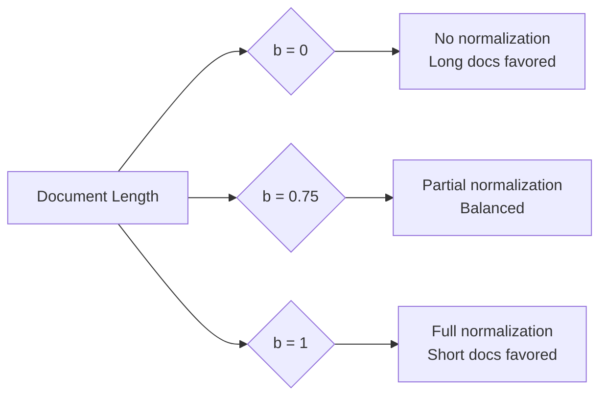
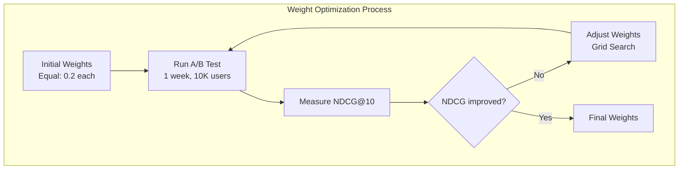
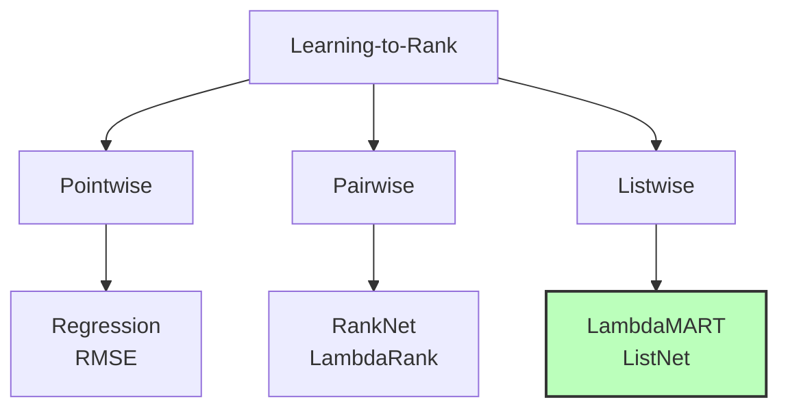

# پیش نویس پروژه

# 

## خلاصه اجرایی

این داکیومنت یک معماری کامل Production-ready برای موتور جستجوی Enterprise-level اینستاگرام ارائه می‌دهد. هدف ما ساخت سیستمی است که بتواند **صدها میلیون پست** و **دهها میلیون صفحه** را با **Latency کمتر از 300 میلی‌ثانیه** و **Throughput بالای 10,000 Query Per Second** جستجو کند.

### چرا این پروژه پیچیده است؟

جستجو در Social Media با جستجوی معمولی تفاوت‌های اساسی دارد:


1. **ا Scale**: حجم داده بسیار بالا (100M+ documents) که نیاز به sharding و distribution دارد
2. **ا Real-time**: محتوا باید در کمتر از 30 ثانیه پس از publish قابل جستجو باشد
3. **ا Relevance**: کاربران انتظار دارند relevant ترین نتایج را ببینند، نه فقط keyword match
4. **ا Multimodal**: باید در text (caption)، OCR از images، transcription از videos جستجو کنیم
5. **ا Social Signals**: Engagement metrics (likes, comments) باید در ranking تأثیر داشته باشند
6. **ا Fresh Content**: محتوای جدید اغلب relevant تر از محتوای قدیمی است (time decay)

### اهداف قابل اندازه‌گیری

| Metric | Target | توضیح |
|----|----|----|
| Query Latency (P95) | <300ms | 95% queries باید در کمتر از 300ms پاسخ بگیرند |
| Throughput | 10,000 QPS | توانایی handle کردن 10 هزار query در ثانیه |
| Indexing Latency | <30s | محتوای جدید باید در 30 ثانیه searchable شود |
| Availability | 99.95% | حداکثر 4.38 ساعت downtime در سال |
| NDCG@10 | >0.80 | کیفیت ranking (توضیح بیشتر در بخش metrics) |


---

## 1. انتخاب Technology Stack

### 1.1 چرا Elasticsearch؟

**دلایل اصلی:**


1. **ا Full-Text Search Native**: Elasticsearch به صورت native برای full-text search طراحی شده است. برخلاف SQL databases که full-text search یک feature اضافی است، Elasticsearch از ابتدا برای این کار ساخته شده.
2. **ا Horizontal Scalability**: می‌توانیم با اضافه کردن node های جدید، ظرفیت را افزایش دهیم. Elasticsearch به صورت خودکار data را بین nodes توزیع می‌کند.
3. **ا Vector Search Support**: از نسخه 8.x به بعد، Elasticsearch از dense vector fields و kNN search پشتیبانی می‌کند که برای semantic search ضروری است.
4. **ا Near Real-time**: Elasticsearch با refresh interval 1 ثانیه (که ما آن را 30 ثانیه می‌کنیم)، near real-time indexing دارد.
5. **ا Rich Query DSL**: Query DSL بسیار قدرتمند است و می‌توانیم queries پیچیده بسازیم.

**Alternatives و چرا انتخاب نشدند:**

* **ا Apache Solr**: قدیمی‌تر، community کوچک‌تر، vector search ضعیف‌تر
* **ا Algolia**: خدمات managed ولی محدودیت‌های pricing و customization
* **ا Meilisearch**: جدید، community کوچک، feature های کمتر
* **ا Typesense**: مناسب small-scale، برای 100M+ documents proven نیست

```mermaidjs
graph TB
    subgraph "چرا Elasticsearch؟"
        A[Requirements] --> B{Scale}
        A --> C{Real-time}
        A --> D{Vector Search}
        A --> E{Complex Queries}
        
        B -->|100M+ docs| F[✓ Elasticsearch]
        C -->|<30s indexing| F
        D -->|Semantic search| F
        E -->|Bool + Script| F
        
        B -->|Limited| G[✗ Algolia]
        C -->|Slow| H[✗ Solr]
        D -->|Weak| H
    end
```

### 1.2 چرا SQL Server؟

**دلایل اصلی:**


1. **ا ACID Transactions**: برای consistency و data integrity که Elasticsearch ندارد
2. **ا Source of Truth**: Elasticsearch یک search index است، نه database. SQL Server منبع اصلی data است
3. **اا Structured Queries**: برای analytics و reporting، SQL بسیار قدرتمندتر است
4. **ا Change Data Capture (CDC)**: SQL Server CDC ما را قادر می‌سازد تغییرات را track کنیم و به Elasticsearch sync کنیم
5. **ا Mature Ecosystem**: Backup/restore، monitoring، tooling بسیار mature است

**چرا نه PostgreSQL؟**

ا PostgreSQL هم گزینه خوبی است، اما:

* ا SQL Server در Enterprise environments بیشتر استفاده می‌شود
* ا Integration با .NET/C# راحت‌تر است
* ا TDE (Transparent Data Encryption) out-of-the-box
* ما فرض می‌کنیم تیم با SQL Server familiar تر است

### 1.3 چرا Kafka + Flink؟

**Kafka:**


1. **ا Decoupling**: Producer و Consumer از هم جدا هستند
2. **ا Durability**: Messages در disk persist می‌شوند (7 روز retention)
3. **ا Scalability**: Partitioning برای parallel processing
4. **ا Reliability**: Replication برای fault tolerance

**Flink:**


1. **ا Stateful Processing**: می‌توانیم state نگه داریم (مثلاً برای deduplication)
2. **ا  Exactly-Once Semantics**: تضمین می‌کند هر message دقیقاً یک بار process شود
3. **ا Low Latency**: برای real-time processing بهینه است
4. **ا Rich Operators**: Window functions، aggregations، joins

 **Alternative: Apache Spark Streaming**

ا Spark Streaming هم خوب است اما:

* ا Micro-batch model دارد (latency بیشتر)
* ا Flink برای true streaming بهتر است
* ا Flink state management قوی‌تر است

```mermaidjs
graph LR
    subgraph "Stream Processing Pipeline"
        A[Raw Data] -->|Ingest| B[Kafka Topics]
        B -->|Consume| C[Flink Jobs]
        C -->|Transform| D[Processed Data]
        D -->|Dual Write| E[SQL Server]
        D -->|Dual Write| F[Elasticsearch]
        
        style C fill:#f9f,stroke:#333,stroke-width:2px
    end
```

### 1.4 چرا Redis برای Caching؟


1. **In-Memory**: Sub-millisecond latency
2. **Data Structures**: Support برای String، Hash، List، Set (ما String استفاده می‌کنیم)
3. **TTL Support**: Automatic expiration
4. **Distributed**: می‌توانیم Redis Cluster داشته باشیم
5. **Persistence**: RDB snapshots + AOF برای durability

**Alternative: Memcached**

Memcached ساده‌تر است اما:

* TTL per key ندارد (فقط global)
* Data structures ندارد
* Persistence ندارد
* Redis feature-rich تر است


---

## 2. معماری کامل سیستم با توضیحات

### 2.1 نگاه کلی (High-Level Architecture)

```mermaidjs
graph TB
    subgraph "Client Layer"
        CL1[Web App]
        CL2[Mobile App]
        CL3[API Clients]
    end
    
    subgraph "API Gateway"
        AG[NGINX/ALB]
        RL[Rate Limiter]
        AUTH[Auth Service]
    end
    
    subgraph "Application Layer"
        SS[Search Service]
        IS[Ingestion Service]
        ES[Embedding Service]
    end
    
    subgraph "Caching Layer"
        RC[Redis Cluster]
    end
    
    subgraph "Search Layer"
        ESC[Elasticsearch Cluster]
    end
    
    subgraph "Streaming Layer"
        KC[Kafka Cluster]
        FL[Flink Processor]
    end
    
    subgraph "Data Layer"
        SQL[SQL Server]
    end
    
    CL1 & CL2 & CL3 --> AG
    AG --> RL --> AUTH
    AUTH --> SS
    AUTH --> IS
    
    SS --> RC
    RC -.Cache Miss.-> ESC
    SS --> ESC
    
    IS --> KC
    KC --> FL
    FL --> SQL
    FL --> ESC
    
    SQL -.CDC.-> FL
    
    style SS fill:#bbf,stroke:#333,stroke-width:2px
    style ESC fill:#bfb,stroke:#333,stroke-width:2px
    style SQL fill:#fbb,stroke:#333,stroke-width:2px
```

### 2.2 توضیح جزئیات هر Layer

#### 2.2.1 API Gateway Layer

**مسئولیت:** First line of defense و entry point واحد برای تمام requests.

**چرا NGINX یا AWS ALB؟**

* **NGINX**:
  * Open-source، رایگان
  * Performance بالا (100K+ requests/sec)
  * Flexible configuration
  * واسط برای rate limiting، circuit breaking
* **AWS ALB (Application Load Balancer)**:
  * Managed service (کمتر maintenance)
  * Auto-scaling
  * Health checks integrated
  * SSL/TLS termination

**Rate Limiting چگونه کار می‌کند؟**

```mermaidjs
sequenceDiagram
    participant Client
    participant RateLimiter
    participant Redis
    participant Backend
    
    Client->>RateLimiter: Request
    RateLimiter->>Redis: INCR user:123:count
    Redis-->>RateLimiter: Current count (45)
    
    alt Count <= Limit (100)
        RateLimiter->>Redis: EXPIRE user:123:count 60
        RateLimiter->>Backend: Forward request
        Backend-->>RateLimiter: Response
        RateLimiter-->>Client: 200 OK
    else Count > Limit
        RateLimiter-->>Client: 429 Too Many Requests
    end
```

**توضیح Algorithm:**

ما از **Sliding Window Counter** استفاده می‌کنیم:


1. هر user یک key در Redis دارد: `rate_limit:user:{user_id}:{timestamp_minute}`
2. با هر request، counter را increment می‌کنیم
3. اگر counter بیشتر از limit شد، request را reject می‌کنیم
4. TTL روی key می‌گذاریم تا بعد از 1 دقیقه expire شود

**چرا نه Fixed Window؟**

Fixed Window یک مشکل دارد: در edge of window می‌توانند 2× traffic بفرستند.

مثال:

* Limit = 100 req/min
* 00:00:50 - 00:00:59: 100 request
* 00:01:00 - 00:01:09: 100 request
* در 20 ثانیه، 200 request! (burst)

Sliding Window این مشکل را ندارد.

#### 2.2.2 Search Service (Core Business Logic)

**Architecture Pattern: Layered Architecture**

```mermaidjs
graph TB
    subgraph "Search Service Layers"
        API[API Layer - Controllers]
        BL[Business Logic - Services]
        DL[Data Access - Repositories]
        
        API --> BL
        BL --> DL
        
        subgraph "Cross-Cutting Concerns"
            LOG[Logging]
            MON[Monitoring]
            CACHE[Caching]
        end
        
        API -.-> LOG
        BL -.-> MON
        DL -.-> CACHE
    end
```

**چرا Singleton ElasticClient؟**

```csharp
// ❌ BAD: Creating client per request
public class SearchService
{
    public async Task<Result> SearchAsync(string query)
    {
        var client = new ElasticClient(...); // هر بار client جدید!
        return await client.SearchAsync(...);
    }
}

// ✅ GOOD: Singleton pattern
public class SearchService
{
    private readonly IElasticClient _client; // یک instance در کل app
    
    public SearchService(IElasticClient client)
    {
        _client = client; // Injected via DI
    }
}
```

**دلیل:**


1. **Connection Pooling**: ElasticClient داخلاً connection pool دارد. اگر هر بار instance جدید بسازیم، این pool از بین می‌رود.
2. **Memory**: هر ElasticClient چند MB memory می‌گیرد. با 10,000 req/sec، اگر هر request یک client بسازد، memory exhaustion خواهیم داشت.
3. **Performance**: ساخت client overhead دارد (DNS lookup، connection establishment).

**Thread Safety:**

ElasticClient thread-safe است. می‌توانیم همزمان از multiple threads استفاده کنیم.

#### 2.2.3 Elasticsearch Cluster

**چگونه Sharding کار می‌کند؟**

```mermaidjs
graph TB
    subgraph "Document Routing"
        DOC[Document: post_id=12345]
        HASH[Hash Function]
        SHARD[Shard = hash % num_shards]
        
        DOC --> HASH
        HASH -->|hash = 54321| SHARD
        SHARD -->|54321 % 18 = 15| S15[Shard 15]
    end
    
    subgraph "Shard Distribution"
        S15 --> N1[Node 1 - Primary]
        S15 --> N2[Node 2 - Replica]
    end
```

**چرا 18 Shards؟**

محاسبه:

* Total data: 100M posts × 5KB = 500GB
* Optimal shard size: 10-50GB (Elasticsearch recommendation)
* 500GB ÷ 18 = 27.7GB per shard ✓

**چرا نه 10 Shards یا 30 Shards؟**

* **کمتر از 10**: هر shard بزرگ‌تر از 50GB می‌شود → slow performance
* **بیشتر از 30**: overhead of coordination بالا می‌رود → slow searches

**Replication Factor = 1**

یعنی هر shard یک replica دارد:

* Primary shard: روی node 1
* Replica shard: روی node 2

اگر node 1 down شود، node 2 ادامه می‌دهد.

**Over-Sharding Problem:**

اگر تعداد shards خیلی زیاد باشد:


1. Memory overhead: هر shard حافظه مصرف می‌کند
2. Coordination cost: Elasticsearch باید نتایج از همه shards را merge کند
3. Scatter-gather queries: query به همه shards می‌رود (broadcast)

**Under-Sharding Problem:**

اگر تعداد shards خیلی کم باشد:


1. Large shard size → slow indexing/searching
2. Hot shards: برخی shards ممکن است بیشتر استفاده شوند
3. Limited parallelism: کمتر parallel search می‌شود

**Index Lifecycle Management (ILM):**

```mermaidjs
stateDiagram-v2
    [*] --> Hot: New document
    Hot --> Warm: After 30 days
    Warm --> Cold: After 90 days
    Cold --> Delete: After 365 days
    
    note right of Hot
        Fast SSD
        Heavy indexing
        Frequent searches
    end note
    
    note right of Warm
        Shrink shards
        Force merge
        Reduce replicas
    end note
    
    note right of Cold
        Slow storage
        Freeze index
        Searchable snapshot
    end note
```

**توضیح:**

* **Hot tier**: محتوای جدید، روی SSD سریع، indexing مکرر
* **Warm tier**: محتوای 1 ماهه، shrink می‌کنیم (18 shard → 6 shard)، force merge
* **Cold tier**: محتوای قدیمی‌تر، روی HDD ارزان‌تر، frozen (searchable snapshot)
* **Delete**: محتوای بیش از 1 سال را پاک می‌کنیم

**چرا این approach؟**


1. **Cost Optimization**: Storage cost برای old data کمتر می‌شود
2. **Performance**: Hot tier برای new data fast است
3. **Compliance**: می‌توانیم old data را نگه داریم (legal requirements)

#### 2.2.4 SQL Server شیما و Optimizations

**چرا Normalization؟**

```sql
-- ❌ Denormalized (Bad for updates)
CREATE TABLE Posts (
    post_id BIGINT PRIMARY KEY,
    hashtag1 VARCHAR(100),
    hashtag2 VARCHAR(100),
    hashtag3 VARCHAR(100),
    ...
);

-- ✅ Normalized (Good for consistency)
CREATE TABLE Posts (
    post_id BIGINT PRIMARY KEY,
    caption NVARCHAR(MAX)
);

CREATE TABLE Hashtags (
    hashtag_id BIGINT PRIMARY KEY,
    hashtag NVARCHAR(255) UNIQUE
);

CREATE TABLE PostHashtags (
    post_id BIGINT REFERENCES Posts(post_id),
    hashtag_id BIGINT REFERENCES Hashtags(hashtag_id),
    PRIMARY KEY (post_id, hashtag_id)
);
```

**دلایل:**


1. **No Duplication**: Hashtag "#sunset" فقط یک بار ذخیره می‌شود
2. **Easy Updates**: اگر بخواهیم hashtag را rename کنیم، فقط یک جا عوض می‌شود
3. **Constraints**: می‌توانیم foreign key constraints داشته باشیم

**Indexing Strategy:**

```sql
-- Clustered Index (physical order)
CREATE CLUSTERED INDEX IX_Posts_PostId ON Posts(post_id);

-- Non-Clustered Indexes (logical pointers)
CREATE NONCLUSTERED INDEX IX_Posts_Username ON Posts(username);
CREATE NONCLUSTERED INDEX IX_Posts_Created ON Posts(created_at DESC);
CREATE NONCLUSTERED INDEX IX_Posts_Engagement 
    ON Posts(engagement_score DESC) 
    INCLUDE (username, caption);
```

**توضیح Clustered vs Non-Clustered:**

* **Clustered Index**: تعیین می‌کند data فیزیکاً چگونه روی disk ذخیره شود. فقط **یک** clustered index می‌توانیم داشته باشیم. معمولاً روی Primary Key است.
* **Non-Clustered Index**: یک structure جداگانه است که pointer به clustered index دارد. می‌توانیم **چند** non-clustered index داشته باشیم.

**INCLUDE Clause چیست؟**

```sql
CREATE INDEX IX_Posts_Engagement 
    ON Posts(engagement_score DESC) 
    INCLUDE (username, caption);
```

این یعنی:

* Index بر اساس `engagement_score` sort می‌شود
* ولی `username` و `caption` هم در index ذخیره می‌شوند
* وقتی query فقط این columns را می‌خواهد، نیازی به رفتن به main table نیست (covering index)

**مثال:**

```sql
-- این query از index استفاده می‌کند و نیازی به table lookup ندارد
SELECT username, caption
FROM Posts
WHERE engagement_score > 1000
ORDER BY engagement_score DESC;
```

**Change Data Capture (CDC):**

CDC چگونه کار می‌کند؟

```mermaidjs
sequenceDiagram
    participant App
    participant SQL
    participant CDCTable
    participant Flink
    participant ES
    
    App->>SQL: UPDATE Posts SET likes=100 WHERE id=1
    SQL->>SQL: Write to transaction log
    SQL->>CDCTable: Capture change
    
    Note over CDCTable: Change table:<br/>op=UPDATE<br/>id=1<br/>likes=100
    
    Flink->>CDCTable: Poll for changes
    CDCTable-->>Flink: Return changes
    Flink->>ES: Update document
```

**مزایا:**


1. **Low Overhead**: CDC از transaction log استفاده می‌کند، پرس و جوی مستقیم ندارد
2. **All Changes**: همه INSERT، UPDATE، DELETE capture می‌شود
3. **Ordering**: ترتیب changes حفظ می‌شود
4. **No Code Changes**: نیازی به تغییر application code نیست


---

## 3. الگوریتم‌های جستجو - توضیح کامل

### 3.1 BM25 Algorithm (Best Matching 25)

**فرمول ریاضی:**

$$
\text{BM25}(q, d) = \sum_{i=1}^{n} \text{IDF}(q_i) \cdot \frac{f(q_i, d) \cdot (k_1 + 1)}{f(q_i, d) + k_1 \cdot (1 - b + b \cdot \frac{|d|}{\text{avgdl}})}
$$

**اجزای فرمول:**


1. **IDF (Inverse Document Frequency)**:

   $$
   \text{IDF}(q_i) = \log\left(\frac{N - n(q_i) + 0.5}{n(q_i) + 0.5} + 1\right)
   $$
   * $N$: تعداد کل documents
   * $n(q_i)$: تعداد documents که term $q_i$ را دارند

   **معنی:** Terms که در کمتر documents هستند، مهم‌تر هستند.

   **مثال:**
   * Query: "best coffee shop"
   * "best": در 50M documents است → IDF کم
   * "coffee": در 5M documents است → IDF متوسط
   * "shop": در 10M documents است → IDF متوسط

   پس "coffee" و "shop" بیشتر از "best" در scoring تأثیر دارند.
2. **Term Frequency (TF)**:

   $$
   \text{TF} = \frac{f(q_i, d) \cdot (k_1 + 1)}{f(q_i, d) + k_1 \cdot (1 - b + b \cdot \frac{|d|}{\text{avgdl}})}
   $$
   * $f(q_i, d)$: تعداد دفعاتی که term در document ظاهر می‌شود
   * $k_1$: tuning parameter (معمولاً 1.2 - 2.0)
   * $b$: length normalization (0 - 1)
   * $|d|$: طول document (تعداد terms)
   * $\text{avgdl}$: میانگین طول documents

**چرا این فرمول پیچیده است؟**

فرمول ساده TF-IDF:

$$
\text{score} = \text{TF} \times \text{IDF}
$$

مشکل: اگر یک term 100 بار در document باشد، score خیلی بالا می‌شود (keyword stuffing).

ا BM25 این را حل می‌کند با **saturation**: بعد از تعداد معینی، افزایش TF تأثیر کمی دارد.

```python
import matplotlib.pyplot as plt
import numpy as np

# Simulate TF effect
tf_values = np.arange(0, 50, 1)
k1 = 1.5

# Simple TF (linear)
simple_tf = tf_values

# BM25 TF (saturating)
bm25_tf = (tf_values * (k1 + 1)) / (tf_values + k1)

plt.plot(tf_values, simple_tf, label='Simple TF (Linear)')
plt.plot(tf_values, bm25_tf, label='BM25 TF (Saturating)')
plt.xlabel('Term Frequency')
plt.ylabel('Score Contribution')
plt.legend()
plt.title('BM25 Saturation Effect')
```

**Output:** بعد از TF=10، BM25 score خیلی کم افزایش می‌یابد، ولی simple TF خطی ادامه می‌دهد.

**Length Normalization (**$b$ **parameter):**



**چرا b=0.75 برای Social Media؟**

* Captions معمولاً کوتاه هستند (50-200 کاراکتر)
* می‌خواهیم captions طولانی penalize نشوند، ولی keyword stuffing هم prevent شود
* b=0.75 تعادل خوبی است

**Field Boosting:**

```json
{
  "query": {
    "multi_match": {
      "query": "sunset beach",
      "fields": [
        "caption^5",      // 5x weight
        "hashtags^3",     // 3x weight
        "ocr_text^2",     // 2x weight
        "comments^1"      // 1x weight
      ]
    }
  }
}
```

**منطق:**


1. **caption^5**: Caption اصلی‌ترین محتوا است → وزن بالا
2. **hashtags^3**: Hashtags معنی‌دار هستند → وزن متوسط
3. **ocr_text^2**: OCR ممکن است خطا داشته باشد → وزن کمتر
4. **comments^1**: Comments ممکن است off-topic باشند → وزن پایه

### 3.2 Vector Search با HNSW

**چرا Vector Search؟**

ا BM25 فقط exact keyword match می‌کند. مثال:

* Query: "cute puppy"
* Document 1: "adorable dog" ← BM25 score = 0 (no match)
* Document 2: "cute puppy" ← BM25 score = high

ولی Document 1 semantically relevant است!

Vector search این را حل می‌کند با **embeddings**.

**Embeddings چیست؟**

تبدیل text به vector در فضای high-dimensional:

```
"cute puppy" → [0.23, -0.45, 0.12, ..., 0.67]  (384 dimensions)
"adorable dog" → [0.21, -0.43, 0.14, ..., 0.65]
```

این vectors نزدیک به هم هستند (cosine similarity ≈ 0.92).

**چگونه Embeddings generate می‌شوند؟**

ما از **Sentence Transformers** استفاده می‌کنیم:

```python
from sentence_transformers import SentenceTransformer

model = SentenceTransformer('all-MiniLM-L12-v2')

# Generate embedding
text = "Beautiful sunset at the beach"
embedding = model.encode(text)
print(embedding.shape)  # (384,)
```

**چرا این model؟**

* **Size**: 33M parameters (سبک، سریع)
* **Dimensions**: 384 (balance بین accuracy و speed)
* **Quality**: SOTA performance روی semantic similarity tasks
* **Multilingual**: Support برای 50+ زبان

**Alternatives:**

| Model | Dimensions | Performance | Speed |
|----|----|----|----|
| all-MiniLM-L12-v2 | 384 | Good | Fast |
| all-mpnet-base-v2 | 768 | Better | Slower |
| BERT-base | 768 | Good | Slow |
| USE (Universal Sentence Encoder) | 512 | Good | Medium |

**HNSW Algorithm (Hierarchical Navigable Small World)**

HNSW یک graph-based algorithm برای Approximate Nearest Neighbor (ANN) search است.

```mermaidjs
graph TB
    subgraph "HNSW Layers"
        L0[Layer 0 - All Points]
        L1[Layer 1 - Subset]
        L2[Layer 2 - Smaller Subset]
        
        L2 -.Navigate.-> L1
        L1 -.Navigate.-> L0
    end
    
    subgraph "Search Process"
        Q[Query Vector]
        Q -->|1. Start at top layer| L2
        L2 -->|2. Find closest| N1[Node 1]
        N1 -->|3. Descend| L1
        L1 -->|4. Find closer| N2[Node 2]
        N2 -->|5. Descend| L0
        L0 -->|6. Final neighbors| R[Results]
    end
```

**چگونه کار می‌کند؟**


1. **Build Phase:**
   * Graph چند لایه می‌سازیم
   * هر node به `M` neighbors متصل می‌شود
   * لایه‌های بالا sparse هستند (navigational)
   * لایه پایین dense است (exhaustive)
2. **Search Phase:**
   * از لایه بالا شروع می‌کنیم
   * greedy search تا نزدیک‌ترین node
   * به لایه پایین می‌رویم
   * این را تکرار می‌کنیم
   * در لایه پایین، k نزدیک‌ترین neighbors را برمی‌گردانیم

**Parameters:**

```json
{
  "index_options": {
    "type": "int8_hnsw",
    "m": 16,               // connections per layer
    "ef_construction": 100 // candidates during build
  }
}
```

**Trade-offs:**

| Parameter | ↑ زیاد کردن | ↓ کم کردن |
|----|----|----|
| **m** | + Accuracy<br>- Build time<br>- Memory | + Speed<br>+ Memory<br>- Accuracy |
| **ef_construction** | + Accuracy<br>- Build time | + Speed<br>- Accuracy |

**Query-time Parameter:**

```json
{
  "knn": {
    "field": "caption_vector",
    "query_vector": [...],
    "k": 100,
    "num_candidates": 500  // ef_search
  }
}
```

**ef_search (num_candidates):**

* تعداد candidates که explore می‌شوند
* هرچه بیشتر → accuracy بیشتر، ولی slow تر
* Rule of thumb: 5× - 10× k

**int8 Quantization چیست؟**

Quantization یعنی تبدیل float32 → int8:

```
float32: [-0.456, 0.234, -0.891, ...]  (4 bytes per dim)
int8:    [-117, 60, -228, ...]          (1 byte per dim)
```

**مزایا:**

* **4× کمتر memory**: 384 dims × 4 bytes = 1536 bytes → 384 bytes
* **Faster computation**: CPU operations روی int سریع‌تر است

**معایب:**

* **Precision loss**: از 32-bit به 8-bit می‌رویم
* **Slight accuracy drop**: معمولاً <2% drop در recall

**چگونه quantize می‌کنیم؟**

```python
# Original float32 vector
vector_f32 = np.array([0.234, -0.456, 0.891, ...])

# Quantize to int8
min_val, max_val = vector_f32.min(), vector_f32.max()
scale = (max_val - min_val) / 255
vector_i8 = ((vector_f32 - min_val) / scale).astype(np.int8)

# Dequantize (for similarity computation)
vector_restored = vector_i8 * scale + min_val
```

**Cosine Similarity vs Dot Product:**

```python
import numpy as np

v1 = np.array([1, 2, 3])
v2 = np.array([2, 3, 4])

# Cosine similarity
cos_sim = np.dot(v1, v2) / (np.linalg.norm(v1) * np.linalg.norm(v2))
print(cos_sim)  # 0.992

# Dot product
dot_prod = np.dot(v1, v2)
print(dot_prod)  # 20
```

**چرا cosine؟**

* **Normalized**: مستقل از magnitude است
* **Range**: \[-1, 1\] → easy to interpret
* **Semantic**: برای sentence embeddings بهتر است

**چرا نه Euclidean Distance؟**

```python
# Euclidean distance
euclidean = np.linalg.norm(v1 - v2)
```

* برای high-dimensional vectors، Euclidean distance کمتر discriminative است
* Cosine فقط به direction توجه می‌کند، نه magnitude

### 3.3 Hybrid Search - ترکیب BM25 + Vector

**چرا Hybrid؟**

| Approach | Pros | Cons |
|----|----|----|
| **BM25 Only** | • Fast<br>• Exact match<br>• Explainable | • No semantic understanding<br>• Vocabulary mismatch |
| **Vector Only** | • Semantic understanding<br>• Synonyms | • Slow (kNN)<br>• May return irrelevant results |
| **Hybrid** | • Best of both<br>• Robust | • Complexity<br>• Tuning needed |

**چگونه Combine می‌کنیم؟**

دو approach اصلی:


1. **Linear Combination:**

   $$
   \text{score} = \alpha \cdot \text{BM25} + (1-\alpha) \cdot \text{Vector}
   $$
2. **Rank Fusion:** Reciprocal Rank Fusion (RRF):

   $$
   \text{RRF}(d) = \sum_{r \in R} \frac{1}{k + r(d)}
   $$

   که $r(d)$ rank of document $d$ در ranking $r$ است.

**ما از چه استفاده می‌کنیم?**

ما از **Weighted Score Combination** استفاده می‌کنیم:

```
Final Score = 0.30 × BM25 +
              0.25 × Vector +
              0.20 × Engagement +
              0.15 × Recency +
              0.10 × Authority
```

**چرا این weights؟**

این weights از A/B testing و optimization بدست آمده‌اند:



**توضیح هر Weight:**


1. **BM25 (30%)**: بالاترین weight چون:
   * Users اغلب exact keywords می‌زنند
   * مثلاً: "#sunset" → می‌خواهند posts با hashtag sunset ببینند
2. **Vector (25%)**: کمی کمتر چون:
   * Semantic search خوب است ولی گاهی noisy است
   * ممکن است results irrelevant برگرداند
3. **Engagement (20%)**: مهم چون:
   * Posts با engagement بالا معمولاً quality دارند
   * Users like می‌کنند content popular ببینند
4. **Recency (15%)**: متوسط چون:
   * برای trending topics خیلی مهم است
   * ولی برای evergreen content کمتر مهم
5. **Authority (10%)**: کمترین چون:
   * Account authority کمتر از content relevance مهم است
   * ولی verified accounts کمی boost می‌شوند

**Implementation در Elasticsearch:**

```json
{
  "query": {
    "script_score": {
      "query": {
        "bool": {
          "should": [
            {
              "multi_match": {
                "query": "{{query}}",
                "fields": ["caption^5", "hashtags^3"],
                "boost": 0.30
              }
            },
            {
              "script_score": {
                "query": {"match_all": {}},
                "script": {
                  "source": "cosineSimilarity(params.query_vector, 'caption_vector') + 1.0",
                  "params": {"query_vector": [...]},
                  "boost": 0.25
                }
              }
            }
          ]
        }
      },
      "script": {
        "source": """
          double baseScore = _score;
          
          // Engagement Score (20%)
          double engagement = doc['likes_count'].value + 
                            (doc['comments_count'].value * 2);
          double engScore = engagement / (engagement + 500);
          
          // Recency Score (15%) - exponential decay
          long ageMillis = new Date().getTime() - 
                          doc['created_at'].value.toInstant().toEpochMilli();
          double ageDays = ageMillis / (1000.0 * 60 * 60 * 24);
          double recScore = Math.pow(0.5, ageDays / 7.0);
          
          // Authority Score (10%)
          double authScore = doc['author_verified'].value ? 0.7 : 0.3;
          
          return baseScore + (engScore * 0.20) + (recScore * 0.15) + (authScore * 0.10);
        """
      }
    }
  }
}
```

**توضیح Script:**


1. **baseScore**: ترکیب BM25 + Vector (از should clauses)
2. **engScore**: Normalize engagement با saturation function
   * چرا `/ (engagement + 500)`? تا engagement خیلی بالا، score را dominate نکند
3. **recScore**: Exponential decay با half-life 7 روز
   * چرا 7 روز؟ معمولاً content بعد از 1 هفته کمتر relevant می‌شود
4. **authScore**: Simple binary (verified یا نه)

**Engagement Score Saturation:**

```python
import matplotlib.pyplot as plt

engagement = np.arange(0, 10000, 100)
score = engagement / (engagement + 500)

plt.plot(engagement, score)
plt.xlabel('Engagement (likes + comments)')
plt.ylabel('Normalized Score')
plt.title('Engagement Score Saturation')
plt.grid(True)
```

**Recency Decay:**

```python
days = np.arange(0, 30, 1)
recency_score = 0.5 ** (days / 7)

plt.plot(days, recency_score)
plt.xlabel('Age (days)')
plt.ylabel('Recency Score')
plt.title('Exponential Decay (Half-life = 7 days)')
plt.grid(True)
```

### 3.4 Learning-to-Rank (LTR)

**چرا LTR؟**

BM25 + Vector + hand-tuned weights خوب است، ولی:

* Optimal weights چیست؟ (شاید 0.30/0.25 بهترین نباشد)
* Feature interactions چه هستند? (شاید engagement × recency تأثیر دارد)
* چگونه از user behavior یاد بگیریم؟

LTR این سوالات را جواب می‌دهد با **Machine Learning**.

**LTR چیست؟**

LTR یک supervised learning problem است:

```
Input: Query + List of Documents
Output: Ranked list of Documents
```

**Types of LTR:**



**چرا LambdaMART؟**

| Approach | Pros | Cons |
|----|----|----|
| **Pointwise** | Simple | Ignores document order |
| **Pairwise** | Considers pairs | Doesn't optimize for metrics |
| **Listwise** (LambdaMART) | Optimizes NDCG | Complex |

**LambdaMART چگونه کار می‌کند؟**


1. **MART (Multiple Additive Regression Trees)**:
   * Ensemble of decision trees
   * هر tree خطای قبلی را correct می‌کند (boosting)
2. **Lambda**:
   * Gradient برای ranking metrics (NDCG)
   * هر pair of documents یک lambda دارد

**Feature Engineering:**

```python
# Example features for a query-document pair
features = {
    # Text relevance
    'bm25_score': 2.34,
    'vector_similarity': 0.87,
    'query_term_coverage': 0.75,  # % of query terms matched
    'exact_match': 1,  # Binary: exact phrase found?
    
    # Engagement
    'likes_count': 1234,
    'comments_count': 56,
    'saves_count': 78,
    'engagement_rate': 0.042,
    
    # Temporal
    'recency_score': 0.65,
    'post_age_hours': 48,
    'is_trending': 0,
    
    # Author
    'author_followers': 50000,
    'author_engagement_rate': 0.035,
    'author_verified': 1,
    
    # Content
    'has_hashtags': 1,
    'hashtag_count': 3,
    'has_location': 1,
    'post_type': 'image',  # categorical
    'caption_length': 150
}
```

**Training Process:**

```mermaidjs
sequenceDiagram
    participant Logs as Click Logs
    participant Prep as Data Prep
    participant Train as Training
    participant Model as LTR Model
    participant Deploy as Deployment
    
    Logs->>Prep: Collect queries + clicks
    Note over Prep: Extract features<br/>Label relevance
    Prep->>Train: Training data
    Note over Train: LambdaMART<br/>Optimize NDCG
    Train->>Model: Trained model
    Model->>Deploy: Export model
    Note over Deploy: C# inference<br/>Re-rank top 100
```

**Relevance Labels:**

از click data می‌توانیم relevance labels استخراج کنیم:

| User Action | Relevance Label |
|----|----|
| No click | 0 (Irrelevant) |
| Click | 1 (Relevant) |
| Click + Like | 2 (Very Relevant) |
| Click + Save | 3 (Highly Relevant) |
| Click + Share | 4 (Extremely Relevant) |

**Training Code (Python/LightGBM):**

```python
import lightgbm as lgb
import pandas as pd
from sklearn.model_selection import train_test_split

# Load data
data = pd.read_csv('training_data.csv')

# Features
features = [
    'bm25_score', 'vector_similarity', 'query_term_coverage',
    'likes_count', 'comments_count', 'engagement_rate',
    'recency_score', 'author_followers', 'author_verified',
    'has_hashtags', 'has_location'
]

X = data[features]
y = data['relevance_label']  # 0-4
query_ids = data['query_id']

# Group data by query
group_sizes = query_ids.value_counts().sort_index().values

# Create LightGBM dataset
train_data = lgb.Dataset(X, label=y, group=group_sizes)

# LambdaMART parameters
params = {
    'objective': 'lambdarank',
    'metric': 'ndcg',
    'ndcg_eval_at': [1, 3, 5, 10],
    'learning_rate': 0.05,
    'num_leaves': 31,
    'min_data_in_leaf': 20,
    'feature_fraction': 0.8,
    'bagging_fraction': 0.8,
    'bagging_freq': 5,
    'max_depth': 6
}

# Train
model = lgb.train(
    params,
    train_data,
    num_boost_round=100,
    valid_sets=[train_data],
    callbacks=[lgb.early_stopping(stopping_rounds=10)]
)

# Feature importance
importance = model.feature_importance(importance_type='gain')
feature_names = model.feature_name()

for name, imp in zip(feature_names, importance):
    print(f"{name}: {imp}")

# Export
model.save_model('ltr_model.txt')
```

**Feature Importance Example Output:**

```
vector_similarity: 2845.3
bm25_score: 2341.7
engagement_rate: 1876.4
recency_score: 1234.2
author_followers: 987.1
...
```

**Inference در C#:**

چگونه این model را در C# استفاده کنیم؟

```csharp
// Option 1: ML.NET (recommended)
using Microsoft.ML;
using Microsoft.ML.Data;

public class LTRPredictor
{
    private readonly PredictionEngine<RankingFeatures, RankingPrediction> _engine;
    
    public LTRPredictor(string modelPath)
    {
        var mlContext = new MLContext();
        var model = mlContext.Model.Load(modelPath, out var schema);
        _engine = mlContext.Model.CreatePredictionEngine<RankingFeatures, RankingPrediction>(model);
    }
    
    public float Predict(RankingFeatures features)
    {
        var prediction = _engine.Predict(features);
        return prediction.Score;
    }
}

// Option 2: ONNX Runtime (faster)
using Microsoft.ML.OnnxRuntime;

public class ONNXPredictor
{
    private readonly InferenceSession _session;
    
    public ONNXPredictor(string modelPath)
    {
        _session = new InferenceSession(modelPath);
    }
    
    public float[] Predict(float[] features)
    {
        var inputTensor = new DenseTensor<float>(features, new[] { 1, features.Length });
        var inputs = new List<NamedOnnxValue>
        {
            NamedOnnxValue.CreateFromTensor("input", inputTensor)
        };
        
        using var results = _session.Run(inputs);
        var output = results.First().AsEnumerable<float>().ToArray();
        return output;
    }
}
```

**Re-ranking Pipeline:**

```csharp
public async Task<List<SearchResult>> SearchWithLTRAsync(string query)
{
    // Step 1: Retrieve candidates (top 100) with Elasticsearch
    var candidates = await _esClient.SearchAsync<Post>(s => s
        .Query(/* hybrid query */)
        .Size(100)
    );
    
    // Step 2: Extract features for each candidate
    var featuresList = candidates.Documents.Select(doc => 
        ExtractFeatures(query, doc)
    ).ToList();
    
    // Step 3: Re-rank with LTR model
    var scores = new List<(Post doc, float score)>();
    foreach (var (doc, features) in candidates.Documents.Zip(featuresList))
    {
        var score = _ltrPredictor.Predict(features);
        scores.Add((doc, score));
    }
    
    // Step 4: Sort by LTR score
    var reranked = scores.OrderByDescending(x => x.score)
                         .Take(20)
                         .Select(x => x.doc)
                         .ToList();
    
    return reranked;
}
```

**Performance Consideration:**

* LTR inference روی 100 documents سریع است (\~10-20ms)
* ولی روی 10,000 documents slow می‌شود
* پس ما فقط top 100 از Elasticsearch را re-rank می‌کنیم

**Continuous Learning:**

```mermaidjs
graph LR
    A[User Interactions] --> B[Click Logs]
    B --> C[Feature Extraction]
    C --> D[Daily Training]
    D --> E[Model Evaluation]
    E --> F{NDCG improved?}
    F -->|Yes| G[Deploy New Model]
    F -->|No| H[Keep Old Model]
    G --> I[Production]
    H --> I
    I --> A
```


---

## 4. Data Pipeline - توضیح کامل

### 4.1 چرا Lambda Architecture؟

```mermaidjs
graph TB
    subgraph "Lambda Architecture"
        DS[Data Source]
        
        subgraph "Speed Layer (Real-time)"
            K[Kafka]
            F[Flink]
            ES[Elasticsearch]
        end
        
        subgraph "Batch Layer (Offline)"
            SQL[SQL Server]
            BATCH[Batch Jobs]
        end
        
        subgraph "Serving Layer"
            API[Search API]
        end
        
        DS --> K
        K --> F
        F --> ES
        F --> SQL
        
        SQL --> BATCH
        BATCH --> ES
        
        ES --> API
        SQL --> API
    end
```

**توضیح:**


1. **Speed Layer**: برای real-time data (new posts)
   * Kafka → Flink → Elasticsearch
   * Latency: <30 seconds
2. **Batch Layer**: برای historical data و corrections
   * SQL Server → Batch Jobs → Elasticsearch
   * Frequency: روزانه یا هفتگی
3. **Serving Layer**: ترکیب نتایج از هر دو

**چرا این approach؟**

* **Freshness**: New content سریع indexable می‌شود
* **Accuracy**: Historical data با batch jobs صحیح می‌شود
* **Resilience**: اگر streaming fail شود، batch می‌تواند compensate کند

### 4.2 Kafka Topic Design

**چرا چند Topic؟**

```
raw-posts          → unprocessed data
processed-posts    → after validation/normalization
enrichment-queue   → for async enrichment (OCR, transcription)
dead-letter-queue  → failed messages
```

**Partitioning Strategy:**

```python
# Partition by user_id (to maintain order per user)
partition = hash(user_id) % num_partitions
```

**چرا؟**

* همه posts از یک user به یک partition می‌روند
* ترتیب posts per user حفظ می‌شود
* هر consumer یک subset از users را می‌خواند

**Retention Policy:**

```yaml
raw-posts:
  retention: 7 days
  reason: "برای replay در صورت مشکل"

processed-posts:
  retention: 7 days
  reason: "برای downstream consumers"

dead-letter-queue:
  retention: 30 days
  reason: "برای debugging"
```

### 4.3 Flink Stream Processing

**چرا Flink ؟**

```mermaidjs
graph LR
    A[Kafka Source] --> B[Flink Operators]
    B --> C[Kafka Sink]
    B --> D[JDBC Sink]
    
    subgraph "Flink Features"
        B --> E[Windowing]
        B --> F[State Management]
        B --> G[Exactly-Once]
    end
```

**مثال: Deduplication Window**

```java
DataStream<Post> stream = env
    .addSource(new FlinkKafkaConsumer<>("raw-posts", deserializer, props))
    .keyBy(post -> post.getPostId())
    .window(TumblingEventTimeWindows.of(Time.hours(24)))
    .reduce(new DeduplicationFunction());

class DeduplicationFunction implements ReduceFunction<Post> {
    @Override
    public Post reduce(Post p1, Post p2) {
        // Keep the most recent
        return p1.getTimestamp() > p2.getTimestamp() ? p1 : p2;
    }
}
```

**توضیح:**


1. **keyBy(postId)**: همه events با یک post_id به یک operator می‌روند
2. **window(24h)**: یک window 24 ساعته
3. **reduce**: اگر duplicate posts در window باشند، فقط جدیدترین را نگه می‌داریم

**چرا 24 ساعت؟**

* معمولاً duplicates در چند دقیقه اول می‌آیند
* 24 ساعت کافی است تا همه duplicates را بگیریم
* بیشتر از این state overhead بالا می‌رود

**Exactly-Once Semantics:**

```java
// Enable checkpointing
env.enableCheckpointing(60000); // 60 seconds
env.getCheckpointConfig().setCheckpointingMode(CheckpointingMode.EXACTLY_ONCE);

// Kafka sink with transactions
FlinkKafkaProducer<Post> sink = new FlinkKafkaProducer<>(
    "processed-posts",
    new PostSerializer(),
    props,
    FlinkKafkaProducer.Semantic.EXACTLY_ONCE
);
```

**چگونه کار می‌کند؟**


1. Flink هر 60 ثانیه checkpoint می‌گیرد (snapshot of state)
2. اگر failure شود، از آخرین checkpoint restart می‌کند
3. Kafka transactions تضمین می‌کند messages exactly once نوشته شوند

### 4.4 Data Normalization

**چرا Normalization مهم است؟**

Social media data بسیار messy است:

```json
{
  "caption": "  Check out this    AMAZING 🔥🔥 sunset!!!  #sunset  #beach   ",
  "created_at": "2024-11-15 10:30:00",
  "hashtags": ["#sunset", "#Sunset", "#SUNSET", "#beach"]
}
```

مشکلات:

* Extra whitespace
* Mixed case
* Duplicate hashtags (case-insensitive)
* Emojis

**Normalization Pipeline:**

```csharp
public class TextNormalizer
{
    public string Normalize(string text)
    {
        if (string.IsNullOrWhiteSpace(text))
            return string.Empty;
        
        // 1. Remove HTML tags
        text = Regex.Replace(text, @"<[^>]+>", string.Empty);
        
        // 2. Normalize Unicode (NFD → NFC)
        text = text.Normalize(NormalizationForm.FormC);
        
        // 3. Handle emojis (keep them, but normalize variants)
        text = NormalizeEmojis(text);
        
        // 4. Remove excessive whitespace
        text = Regex.Replace(text, @"\s+", " ");
        
        // 5. Trim
        return text.Trim();
    }
    
    private string NormalizeEmojis(string text)
    {
        // Some emojis have variants (e.g., 🔥️ vs 🔥)
        // Normalize to standard form
        return text; // Simplified
    }
}

public class HashtagNormalizer
{
    public List<string> Normalize(List<string> hashtags)
    {
        return hashtags
            .Select(h => h.TrimStart('#').ToLowerInvariant())
            .Distinct()
            .ToList();
    }
}
```

**Timestamp Normalization:**

```csharp
public class TimestampNormalizer
{
    public DateTime Normalize(string timestamp)
    {
        // Parse various formats
        DateTime dt;
        
        if (DateTime.TryParse(timestamp, out dt))
        {
            // Convert to UTC
            if (dt.Kind == DateTimeKind.Local)
                dt = dt.ToUniversalTime();
            else if (dt.Kind == DateTimeKind.Unspecified)
                dt = DateTime.SpecifyKind(dt, DateTimeKind.Utc);
            
            return dt;
        }
        
        throw new ArgumentException($"Invalid timestamp: {timestamp}");
    }
}
```

**چرا UTC؟**

* Timezone-independent
* Elasticsearch به UTC expect می‌کند
* Comparison ساده‌تر است

### 4.5 Embedding Generation Pipeline

```mermaidjs
graph TB
    subgraph "Embedding Pipeline"
        P[New Post] --> Q[Embedding Queue]
        Q --> W[Worker Pool]
        W --> M[ML Model]
        M --> V[Vector]
        V --> SQL[(SQL Server)]
        V --> ES[(Elasticsearch)]
    end
    
    subgraph "Worker Pool"
        W --> W1[Worker 1<br/>GPU]
        W --> W2[Worker 2<br/>GPU]
        W --> W3[Worker 3<br/>GPU]
    end
```

**چرا Async؟**

Embedding generation slow است (100-200ms per text). اگر synchronous باشد:

* User باید 200ms منتظر بماند
* Throughput پایین می‌شود (5-10 TPS)

با async approach:

* User فوراً response می‌گیرد
* Embedding در background generate می‌شود
* Throughput بالا (1000+ TPS)

**Worker Pool Implementation:**

```python
import asyncio
from sentence_transformers import SentenceTransformer
import torch

class EmbeddingWorker:
    def __init__(self, model_name, device='cuda'):
        self.model = SentenceTransformer(model_name, device=device)
        self.batch_size = 32
    
    async def process_batch(self, texts):
        # Generate embeddings in batch (efficient!)
        embeddings = self.model.encode(
            texts,
            batch_size=self.batch_size,
            show_progress_bar=False,
            convert_to_numpy=True
        )
        return embeddings
    
    async def run(self, queue):
        while True:
            # Accumulate batch
            batch = []
            for _ in range(self.batch_size):
                try:
                    item = await asyncio.wait_for(queue.get(), timeout=1.0)
                    batch.append(item)
                except asyncio.TimeoutError:
                    break
            
            if not batch:
                continue
            
            # Process batch
            texts = [item['text'] for item in batch]
            embeddings = await self.process_batch(texts)
            
            # Save to DB
            for item, embedding in zip(batch, embeddings):
                await self.save_embedding(item['post_id'], embedding)

# Run multiple workers
async def main():
    queue = asyncio.Queue()
    
    workers = [
        EmbeddingWorker('all-MiniLM-L12-v2', device=f'cuda:{i}')
        for i in range(3)  # 3 GPUs
    ]
    
    tasks = [worker.run(queue) for worker in workers]
    await asyncio.gather(*tasks)
```

**Batch Processing چرا مهم است؟**

```python
# Single processing
for text in texts:
    embedding = model.encode(text)  # 100ms per text
# Total: 100ms × 100 = 10 seconds

# Batch processing
embeddings = model.encode(texts, batch_size=32)  # 500ms for 32 texts
# Total: 500ms × 4 = 2 seconds (5× faster!)
```

GPU ها برای parallel processing optimized هستند.


---

## 5. UI/UX Design - توضیح کامل

### 5.1 چرا Simple + Advanced Search?

```mermaidjs
graph TB
    U[User] --> D{Expertise?}
    D -->|Casual| S[Simple Search]
    D -->|Professional| A[Advanced Search]
    
    S --> S1[Single input box]
    S --> S2[Autocomplete]
    S --> S3[Smart defaults]
    
    A --> A1[Multiple filters]
    A --> A2[Boolean operators]
    A --> A3[Export options]
```

**User Personas:**

| Persona | Need | Interface |
|----|----|----|
| Casual User | "Find sunset photos" | Simple search |
| Marketer | "Posts with >10K likes, last 7 days, location=NYC" | Advanced search |
| Analyst | "Export all posts with #BlackFriday" | Advanced + Export |

### 5.2 Autocomplete Algorithm

**چرا Autocomplete؟**

* 50% of queries می‌توانند autocompleted شوند
* کاربران راحت‌تر می‌توانند search کنند
* Spelling mistakes کمتر می‌شود

**Implementation:**

```json
{
  "suggest": {
    "user-suggest": {
      "prefix": "john",
      "completion": {
        "field": "username.suggest",
        "size": 5,
        "skip_duplicates": true,
        "fuzzy": {
          "fuzziness": 1
        }
      }
    }
  }
}
```

**Fuzziness چیست؟**

```
User types: "johm"
Fuzzy matches:
  - john (edit distance = 1)
  - johny (edit distance = 1)
```

Edit distance = تعداد operations (insert/delete/replace) برای تبدیل یک string به دیگری.

**چرا Completion Suggester نه Search-as-you-type؟**

| Feature | Completion | Search-as-you-type |
|----|----|----|
| **Speed** | Very fast (<10ms) | Slower (\~50ms) |
| **Index size** | Small | Large |
| **Flexibility** | Prefix only | Infix match |
| **Use case** | Autocomplete | Full search |

ما Completion استفاده می‌کنیم چون:

* سرعت critical است (user می‌نویسد)
* Prefix match کافی است (user از اول می‌نویسد)

### 5.3 Result Ranking UI

**چرا Diversity مهم است؟**

اگر top 10 results همه از یک user باشند → bad UX

**Diversity Algorithm:**

```python
def diversify_results(results, max_per_user=2):
    diverse = []
    user_counts = {}
    
    for result in results:
        user = result.username
        count = user_counts.get(user, 0)
        
        if count < max_per_user:
            diverse.append(result)
            user_counts[user] = count + 1
    
    return diverse
```

**Visual Indicators:**

```jsx
const PostCard = ({ post, queryTerms }) => {
    return (
        <div className="post-card">
            {/* Relevance indicator */}
            {post.score > 0.9 && (
                <Badge color="green">Highly Relevant</Badge>
            )}
            
            {/* Highlight matched terms */}
            <Caption 
                text={post.caption}
                highlight={queryTerms}
            />
            
            {/* Social proof */}
            <Engagement>
                <Icon name="like" /> {formatNumber(post.likes)}
                <Icon name="comment" /> {formatNumber(post.comments)}
            </Engagement>
            
            {/* Freshness */}
            {post.ageHours < 24 && (
                <Badge color="blue">New</Badge>
            )}
        </div>
    );
};
```

### 5.4 Accessibility (A11y)

**چرا مهم است؟**

* 15% of population دارای disability هستند
* Screen readers برای blind users
* Keyboard navigation برای motor disabilities
* Legal requirements (ADA compliance)

**ARIA Labels:**

```jsx
<input
    type="text"
    role="searchbox"
    aria-label="Search Instagram posts and pages"
    aria-describedby="search-help"
    aria-autocomplete="list"
    aria-controls="suggestions-list"
    aria-expanded={suggestions.length > 0}
/>

<div id="search-help" className="sr-only">
    Enter keywords to search for posts and pages
</div>
```

**Keyboard Navigation:**

```jsx
const SearchBar = () => {
    const handleKeyDown = (e) => {
        switch(e.key) {
            case 'ArrowDown':
                // Move to next suggestion
                setSelectedIndex(prev => prev + 1);
                break;
            case 'ArrowUp':
                // Move to previous suggestion
                setSelectedIndex(prev => prev - 1);
                break;
            case 'Enter':
                // Select current suggestion
                selectSuggestion(suggestions[selectedIndex]);
                break;
            case 'Escape':
                // Close suggestions
                setSuggestions([]);
                break;
        }
    };
    
    return <input onKeyDown={handleKeyDown} />;
};
```

**Color Contrast:**

```css
/* ❌ Bad: low contrast */
.button {
    background: #ddd;
    color: #aaa;
}

/* ✅ Good: WCAG AAA compliant */
.button {
    background: #0066cc;
    color: #ffffff;
}
```

WCAG (Web Content Accessibility Guidelines) standard:

* AA: contrast ratio ≥ 4.5:1
* AAA: contrast ratio ≥ 7:1


---

## 6. Performance Optimization - توضیح عمیق

### 6.1 Caching Strategy - Multi-Layer

```mermaidjs
graph TB
    Q[Query] --> L1{Browser Cache}
    L1 -->|Hit| R1[Return cached]
    L1 -->|Miss| L2{Redis Cache}
    L2 -->|Hit| R2[Return cached]
    L2 -->|Miss| L3{ES Query Cache}
    L3 -->|Hit| R3[Return cached]
    L3 -->|Miss| ES[Elasticsearch]
    ES --> STORE[Store in all caches]
    STORE --> R4[Return result]
```

**چرا Multi-Layer؟**

| Layer | Hit Rate | Latency | Coverage |
|----|----|----|----|
| Browser | 20% | <1ms | Same user, same query |
| Redis | 50% | \~5ms | All users, popular queries |
| ES Query | 70% | \~20ms | Recent queries |

Combined hit rate:

```
P(hit) = 0.20 + (0.80 × 0.50) + (0.80 × 0.50 × 0.70)
       = 0.20 + 0.40 + 0.28
       = 88% hit rate
```

**Cache Invalidation:**

"There are only two hard problems in Computer Science: cache invalidation and naming things."

**Strategies:**


1. **TTL (Time To Live)**:

   ```
   Browser: 5 minutes
   Redis: 10 minutes
   ES: 1 hour
   ```
2. **Event-Based Invalidation**:

   ```csharp
   public async Task OnPostUpdated(Post post)
   {
       // Invalidate caches that might contain this post
       var patterns = new[]
       {
           $"search:*{post.Username}*",
           $"search:*{string.Join("*", post.Hashtags)}*"
       };
       
       foreach (var pattern in patterns)
       {
           await _cache.InvalidatePatternAsync(pattern);
       }
   }
   ```

**Cache Stampede Problem:**

```mermaidjs
sequenceDiagram
    participant C1 as Client 1
    participant C2 as Client 2
    participant C3 as Client 3
    participant Cache
    participant DB
    
    C1->>Cache: GET key
    Cache-->>C1: MISS
    C2->>Cache: GET key
    Cache-->>C2: MISS
    C3->>Cache: GET key
    Cache-->>C3: MISS
    
    par All hit DB
        C1->>DB: Query
        C2->>DB: Query
        C3->>DB: Query
    end
    
    Note over DB: Overload!
```

**Solution: Lock Pattern**

```csharp
public async Task<SearchResult> GetOrComputeAsync(string cacheKey)
{
    // Try cache
    var cached = await _cache.GetAsync(cacheKey);
    if (cached != null)
        return cached;
    
    // Acquire lock
    var lockKey = $"lock:{cacheKey}";
    var lockAcquired = await _cache.LockAsync(lockKey, TimeSpan.FromSeconds(10));
    
    if (lockAcquired)
    {
        try
        {
            // Double-check cache (maybe another thread filled it)
            cached = await _cache.GetAsync(cacheKey);
            if (cached != null)
                return cached;
            
            // Compute
            var result = await ComputeExpensiveOperationAsync();
            
            // Store
            await _cache.SetAsync(cacheKey, result, TimeSpan.FromMinutes(10));
            
            return result;
        }
        finally
        {
            await _cache.UnlockAsync(lockKey);
        }
    }
    else
    {
        // Wait for other thread to finish
        await Task.Delay(100);
        return await GetOrComputeAsync(cacheKey); // Retry
    }
}
```

### 6.2 Connection Pooling

**چرا Pool؟**

```
Without pooling:
  Request 1: Create connection (100ms) + Query (10ms) + Close (10ms) = 120ms
  Request 2: Create connection (100ms) + Query (10ms) + Close (10ms) = 120ms
  ...

With pooling:
  Request 1: Get from pool (1ms) + Query (10ms) + Return to pool (1ms) = 12ms
  Request 2: Get from pool (1ms) + Query (10ms) + Return to pool (1ms) = 12ms
  ...

10× faster!
```

**Elasticsearch Connection Pool:**

```csharp
var pool = new StaticConnectionPool(new[]
{
    new Uri("https://es-node1:9200"),
    new Uri("https://es-node2:9200"),
    new Uri("https://es-node3:9200")
});

var settings = new ConnectionSettings(pool)
    .MaxRetries(3)
    .MaxRetryTimeout(TimeSpan.FromMinutes(5))
    .DeadTimeout(TimeSpan.FromSeconds(60)); // Mark node as dead after 60s
```

**Round-Robin Load Balancing:**

```
Request 1 → Node 1
Request 2 → Node 2
Request 3 → Node 3
Request 4 → Node 1
...
```

**Sniffing (Dynamic Node Discovery):**

```csharp
var pool = new SniffingConnectionPool(new[]
{
    new Uri("https://es-node1:9200")
});

var settings = new ConnectionSettings(pool)
    .EnableHttpCompression()
    .SniffLifeSpan(TimeSpan.FromMinutes(5)); // Re-discover nodes every 5 min
```

چگونه کار می‌کند؟


1. اتصال به es-node1
2. Query: `GET /_nodes`
3. پاسخ: لیست تمام nodes در cluster
4. Update pool با تمام nodes

**SQL Server Connection Pool:**

```
ConnectionString:
"Server=sql-server;Database=InstagramData;
 Min Pool Size=10;
 Max Pool Size=100;
 Connection Lifetime=300;"
```

Parameters:

* **Min Pool Size**: تعداد connections که همیشه open هستند
* **Max Pool Size**: حداکثر connections همزمان
* **Connection Lifetime**: بعد از 300 ثانیه، connection بسته و دوباره باز می‌شود (برای load balancing)

### 6.3 Bulk Operations

**چرا Bulk؟**

```
Individual requests:
  POST /index/_doc/1 → 50ms
  POST /index/_doc/2 → 50ms
  ...
  POST /index/_doc/1000 → 50ms
  Total: 50 seconds

Bulk request:
  POST /_bulk
  [1000 documents]
  Total: 500ms (100× faster!)
```

**Bulk API:**

```json
POST /_bulk
{"index":{"_index":"instagram_posts","_id":"1"}}
{"post_id":"1","caption":"Beautiful sunset","likes":100}
{"index":{"_index":"instagram_posts","_id":"2"}}
{"post_id":"2","caption":"Amazing view","likes":50}
```

**Optimal Batch Size:**

```python
import time

def benchmark_batch_size():
    sizes = [100, 500, 1000, 2000, 5000]
    
    for size in sizes:
        start = time.time()
        bulk_index(documents, batch_size=size)
        elapsed = time.time() - start
        
        throughput = len(documents) / elapsed
        print(f"Size: {size}, Throughput: {throughput:.0f} docs/sec")
```

**Typical Output:**

```
Size: 100,  Throughput: 5,000 docs/sec
Size: 500,  Throughput: 15,000 docs/sec
Size: 1000, Throughput: 20,000 docs/sec
Size: 2000, Throughput: 18,000 docs/sec  ← Optimal
Size: 5000, Throughput: 10,000 docs/sec
```

چرا 2000 optimal است؟

* کمتر: Overhead of multiple requests
* بیشتر: Network packet too large، timeout risk

**Error Handling در Bulk:**

```csharp
var response = await _client.BulkAsync(bulkDescriptor);

if (response.Errors)
{
    foreach (var item in response.ItemsWithErrors)
    {
        _logger.LogError(
            "Failed to index document {Id}: {Error}",
            item.Id,
            item.Error.Reason
        );
        
        // Send to DLQ
        await _dlq.SendAsync(new
        {
            DocumentId = item.Id,
            Error = item.Error.Reason,
            Timestamp = DateTime.UtcNow
        });
    }
}
```

### 6.4 Query Optimization

**Filter Context vs Query Context:**

```json
{
  "query": {
    "bool": {
      "must": [
        // Query context: scoring enabled
        {"match": {"caption": "sunset"}}
      ],
      "filter": [
        // Filter context: no scoring, cacheable
        {"term": {"post_type": "image"}},
        {"range": {"created_at": {"gte": "2024-01-01"}}}
      ]
    }
  }
}
```

**چرا این تفاوت مهم است؟**

| Aspect | Query Context | Filter Context |
|----|----|----|
| **Scoring** | Yes | No |
| **Caching** | No | Yes |
| **Use case** | Relevance | Filtering |

**مثال:**

```
Query: "sunset beach"
Filters: type=image, date>2024-01-01

Query context (slow):
  {
    "bool": {
      "must": [
        {"match": {"caption": "sunset beach"}},
        {"term": {"post_type": "image"}},
        {"range": {"created_at": {"gte": "2024-01-01"}}}
      ]
    }
  }

Filter context (fast):
  {
    "bool": {
      "must": [
        {"match": {"caption": "sunset beach"}}
      ],
      "filter": [
        {"term": {"post_type": "image"}},
        {"range": {"created_at": {"gte": "2024-01-01"}}}
      ]
    }
  }
```

**Profile API (Query Performance Analysis):**

```json
GET /instagram_posts/_search
{
  "profile": true,
  "query": { ... }
}
```

**Output:**

```json
{
  "profile": {
    "shards": [
      {
        "searches": [
          {
            "query": [
              {
                "type": "TermQuery",
                "description": "post_type:image",
                "time_in_nanos": 5234567,
                "breakdown": {
                  "score": 0,
                  "build_scorer": 1234567,
                  "match": 4000000
                }
              }
            ]
          }
        ]
      }
    ]
  }
}
```

این می‌گوید:

* `TermQuery` روی `post_type` 5.2ms طول کشید
* `build_scorer`: 1.2ms
* `match`: 4.0ms

اگر یک query خیلی slow است، می‌توانیم identify کنیم کدام بخش مشکل دارد.


---

## 7. Monitoring & Observability - عمیق

### 7.1 چرا Observability مهم است؟

```
"Hope is not a strategy."
```

بدون monitoring:

* نمی‌دانیم سیستم چگونه perform می‌کند
* وقتی مشکل پیش می‌آید، نمی‌توانیم diagnose کنیم
* نمی‌توانیم optimize کنیم

**Three Pillars of Observability:**

```mermaidjs
graph TB
    O[Observability]
    
    O --> M[Metrics]
    O --> L[Logs]
    O --> T[Traces]
    
    M --> M1[Time-series data<br/>Quantitative]
    L --> L1[Events<br/>Qualitative]
    T --> T1[Request flow<br/>Distributed]
```

### 7.2 Metrics - تعریف و استفاده

**Types of Metrics:**


1. **Counter**: فقط increase می‌شود

   ```
   search_requests_total
   search_errors_total
   ```
2. **Gauge**: می‌تواند increase/decrease شود

   ```
   active_connections
   memory_usage_bytes
   ```
3. **Histogram**: distribution of values

   ```
   search_latency_seconds
   ```

**چرا Histogram؟**

```python
# Bad: Average only
avg_latency = sum(latencies) / len(latencies)
print(f"Average: {avg_latency}ms")

# Output: 100ms

# But:
latencies = [10, 10, 10, ..., 10, 5000]  # One outlier!
```

Average می‌گوید 100ms، ولی 1% requests 5 ثانیه طول می‌کشد!

**Histogram بهتر است:**

```
search_latency_seconds_bucket{le="0.1"}  9500
search_latency_seconds_bucket{le="0.5"}  9900
search_latency_seconds_bucket{le="1.0"}  9950
search_latency_seconds_bucket{le="5.0"}  10000
```

این می‌گوید:

* 95% requests <100ms
* 99% requests <500ms
* 99.5% requests <1000ms
* 100% requests <5000ms

**Percentiles (P50, P95, P99):**

```
P50 (median): 50% requests faster, 50% slower
P95: 95% requests faster, 5% slower
P99: 99% requests faster, 1% slower
```

P99 مهم است چون outliers را می‌گیرد.

**PromQL Queries:**

```promql
# P95 latency over last 5 minutes
histogram_quantile(0.95, 
  rate(search_latency_seconds_bucket[5m])
)

# Requests per second
rate(search_requests_total[1m])

# Error rate
rate(search_errors_total[5m]) 
  / rate(search_requests_total[5m])
```

### 7.3 Distributed Tracing

**چرا Tracing؟**

```
User request → API Gateway → Search Service → Elasticsearch

If slow (1000ms), where is the bottleneck?
- API Gateway? (50ms)
- Search Service? (200ms)
- Elasticsearch? (750ms)  ← Found it!
```

Tracing این را نشان می‌دهد.

**OpenTelemetry:**

```csharp
using var activity = _activitySource.StartActivity("SearchAsync");

// Add attributes
activity?.SetTag("search.query", query);
activity?.SetTag("search.type", type);

// Child span
using var esActivity = _activitySource.StartActivity("ElasticsearchQuery");
var results = await _client.SearchAsync(...);
esActivity?.SetTag("es.hits", results.Total);
esActivity?.SetStatus(ActivityStatusCode.Ok);

// Parent span
activity?.SetStatus(ActivityStatusCode.Ok);
```

**Jaeger UI:**

```
Search Request (1000ms total)
│
├─ Parse Query (10ms)
├─ Check Cache (50ms)
└─ Elasticsearch Query (940ms)
   │
   ├─ BM25 Search (400ms)
   ├─ Vector Search (500ms)
   └─ Merge Results (40ms)
```

این visualization می‌گوید Vector Search slow است.

**Sampling:**

```csharp
// Sample 10% of requests
var sampler = new TraceIdRatioBasedSampler(0.1);
```

چرا sampling؟

* Tracing overhead دارد
* 100% tracing خیلی data تولید می‌کند
* 10% sampling کافی است برای debugging

### 7.4 Alerting - Smart Alerts

**چرا Smart Alerts؟**

```
❌ Bad alert:
"CPU usage > 80%"

Problem: CPU usage fluctuates, ممکن است false positive باشد
```

```
✅ Good alert:
"CPU usage > 80% for 5 minutes"

This filters noise!
```

**Alert Best Practices:**


1. **Actionable**: باید بدانیم چه کار کنیم
2. **Relevant**: مربوط به user impact باشد
3. **Threshold tuning**: بر اساس historical data

**Example Alert Rule:**

```yaml
- alert: SearchLatencyHigh
  expr: |
    histogram_quantile(0.95, 
      rate(search_latency_seconds_bucket[5m])
    ) > 0.5
  for: 5m
  labels:
    severity: critical
    team: search
  annotations:
    summary: "Search P95 latency above 500ms"
    description: "Current P95: {{ $value }}s"
    runbook: "https://wiki.company.com/runbooks/search-latency"
```

**توضیح:**

* **expr**: PromQL query
* **for: 5m**: باید 5 دقیقه continuous باشد (prevent flapping)
* **severity**: critical (page on-call engineer)
* **runbook**: link به documentation

**Alert Routing:**

```yaml
route:
  receiver: 'team-search'
  group_by: ['alertname', 'severity']
  group_wait: 30s
  group_interval: 5m
  repeat_interval: 4h
  
  routes:
  - match:
      severity: critical
    receiver: 'pagerduty'
  
  - match:
      severity: warning
    receiver: 'slack'
```

**توضیح:**

* **group_by**: alerts مشابه را group می‌کند
* **group_wait**: 30 ثانیه صبر می‌کند (maybe more alerts come)
* **critical** → PagerDuty (page engineer)
* **warning** → Slack (notification only)


---

## 8. Security - لایه‌های امنیتی

### 8.1 Defense in Depth

```mermaidjs
graph TB
    subgraph "Security Layers"
        L1[Network - Firewall/WAF]
        L2[Application - Auth/AuthZ]
        L3[Data - Encryption]
        L4[Monitoring - Audit Logs]
        
        L1 --> L2
        L2 --> L3
        L3 --> L4
    end
```

**هر layer مستقل است:**

* اگر یک layer bypass شود، layers بعدی محافظت می‌کنند
* این principle of least privilege است

### 8.2 JWT Authentication

**چرا JWT؟**

```
Traditional session:
  User → Login → Server stores session in DB
  User → Request → Server queries DB for session
  
  Problem: DB query per request (slow, doesn't scale)

JWT:
  User → Login → Server creates JWT token
  User → Request → Server verifies JWT signature (no DB!)
  
  Benefit: Stateless, fast, scalable
```

**JWT Structure:**

```
Header.Payload.Signature

eyJhbGciOiJIUzI1NiIsInR5cCI6IkpXVCJ9.
eyJ1c2VyX2lkIjoiMTIzIiwicm9sZSI6InVzZXIifQ.
SflKxwRJSMeKKF2QT4fwpMeJf36POk6yJV_adQssw5c
```

**Decoded:**

```json
// Header
{
  "alg": "HS256",
  "typ": "JWT"
}

// Payload
{
  "user_id": "123",
  "role": "user",
  "exp": 1735689600,  // Expiration timestamp
  "iat": 1735603200   // Issued at
}

// Signature
HMACSHA256(
  base64UrlEncode(header) + "." + base64UrlEncode(payload),
  secret
)
```

**چگونه Verify می‌کنیم؟**

```csharp
var tokenHandler = new JwtSecurityTokenHandler();
var key = Encoding.UTF8.GetBytes(_configuration["Jwt:Secret"]);

tokenHandler.ValidateToken(token, new TokenValidationParameters
{
    ValidateIssuerSigningKey = true,
    IssuerSigningKey = new SymmetricSecurityKey(key),
    ValidateIssuer = true,
    ValidIssuer = _configuration["Jwt:Issuer"],
    ValidateAudience = true,
    ValidAudience = _configuration["Jwt:Audience"],
    ValidateLifetime = true,
    ClockSkew = TimeSpan.Zero  // No tolerance for expired tokens
}, out SecurityToken validatedToken);
```

**Claims-Based Authorization:**

```csharp
[Authorize(Policy = "RequireAdvancedSearch")]
[HttpPost("api/v1/search/advanced")]
public async Task<IActionResult> AdvancedSearch(...)
{
    // Only users with "search:advanced" claim can access
}

// Policy definition
services.AddAuthorization(options =>
{
    options.AddPolicy("RequireAdvancedSearch", policy =>
        policy.RequireClaim("permission", "search:advanced"));
});
```

### 8.3 Rate Limiting - Advanced

**چرا Per-User و Per-IP؟**

```
Per-User only:
  Attacker → Creates 1000 accounts → 100K requests
  
Per-IP only:
  Legitimate users behind NAT → Blocked!
  
Both:
  Per-User: 100 req/min
  Per-IP: 10K req/min
  
  Balance between security and UX
```

**Sliding Window Algorithm:**

```csharp
public class SlidingWindowRateLimiter
{
    private readonly IDistributedCache _cache;
    private readonly int _limit = 100;
    private readonly TimeSpan _window = TimeSpan.FromMinutes(1);
    
    public async Task<bool> IsAllowedAsync(string key)
    {
        var now = DateTimeOffset.UtcNow.ToUnixTimeMilliseconds();
        var windowStart = now - (long)_window.TotalMilliseconds;
        
        // Redis sorted set: timestamp → request
        var requests = await _cache.GetSortedSetRangeAsync(
            key,
            windowStart,
            now
        );
        
        if (requests.Count >= _limit)
            return false; // Rate limited
        
        // Add current request
        await _cache.SortedSetAddAsync(key, now, now);
        
        // Cleanup old requests
        await _cache.SortedSetRemoveRangeByScoreAsync(key, 0, windowStart);
        
        // Set expiration
        await _cache.ExpireAsync(key, _window);
        
        return true;
    }
}
```

**Redis Commands:**

```
ZADD rate_limit:user:123 1735689600000 1735689600000
ZCOUNT rate_limit:user:123 1735689540000 1735689600000
ZREMRANGEBYSCORE rate_limit:user:123 0 1735689540000
```

### 8.4 Input Validation

**چرا Validation مهم است؟**

```
SQL Injection:
  Input: "'; DROP TABLE Posts; --"
  Query: SELECT * FROM Posts WHERE caption LIKE '%'; DROP TABLE Posts; --%'
  
  Result: Table deleted!
```

**Defense:**

```csharp
public class SearchRequestValidator : AbstractValidator<SearchRequest>
{
    private static readonly string[] DANGEROUS_PATTERNS = new[]
    {
        "--", "/*", "*/", "xp_", "sp_", "exec", "execute",
        "drop", "delete", "truncate", "insert", "update",
        "<script", "javascript:", "onerror="
    };
    
    public SearchRequestValidator()
    {
        RuleFor(x => x.Query)
            .NotEmpty()
            .MaximumLength(500)
            .Must(NotContainDangerousPatterns)
            .WithMessage("Invalid characters in query");
    }
    
    private bool NotContainDangerousPatterns(string query)
    {
        if (string.IsNullOrWhiteSpace(query))
            return true;
        
        var lower = query.ToLowerInvariant();
        return !DANGEROUS_PATTERNS.Any(p => lower.Contains(p));
    }
}
```

**XSS (Cross-Site Scripting) Prevention:**

```csharp
// Encode output
public string EncodeCaption(string caption)
{
    return HttpUtility.HtmlEncode(caption);
}

// Input: "<script>alert('XSS')</script>"
// Output: "&lt;script&gt;alert('XSS')&lt;/script&gt;"
```

**Content Security Policy (CSP):**

```csharp
app.Use(async (context, next) =>
{
    context.Response.Headers.Add("Content-Security-Policy",
        "default-src 'self'; " +
        "script-src 'self' 'unsafe-inline'; " +
        "style-src 'self' 'unsafe-inline'; " +
        "img-src 'self' data: https:;");
    
    await next();
});
```

این می‌گوید:

* Scripts فقط از همان domain
* No inline scripts (except explicitly allowed)
* Images می‌توانند از هر HTTPS source بیایند


---

## 9. Testing Strategy

### 9.1 Unit Tests

**چرا Unit Testing؟**

```
"Code without tests is broken by design."
```

**مثال:**

```csharp
[Fact]
public void TextNormalizer_ShouldRemoveExtraWhitespace()
{
    // Arrange
    var normalizer = new TextNormalizer();
    var input = "  Hello    World  ";
    
    // Act
    var output = normalizer.Normalize(input);
    
    // Assert
    Assert.Equal("Hello World", output);
}

[Theory]
[InlineData("", "")]
[InlineData("  ", "")]
[InlineData("Hello", "Hello")]
[InlineData("  Hello  ", "Hello")]
public void TextNormalizer_VariousInputs(string input, string expected)
{
    var normalizer = new TextNormalizer();
    var output = normalizer.Normalize(input);
    Assert.Equal(expected, output);
}
```

**Coverage Target:**

```
Total: >80%
Critical paths: 100%
```

### 9.2 Integration Tests

**Elasticsearch Integration Test:**

```csharp
public class ElasticsearchIntegrationTests : IClassFixture<ElasticsearchFixture>
{
    private readonly IElasticClient _client;
    
    public ElasticsearchIntegrationTests(ElasticsearchFixture fixture)
    {
        _client = fixture.Client;
    }
    
    [Fact]
    public async Task Search_ShouldReturnResults()
    {
        // Arrange
        var testData = new[]
        {
            new Post { PostId = "1", Caption = "Beautiful sunset" },
            new Post { PostId = "2", Caption = "Amazing sunrise" }
        };
        
        // Index test data
        foreach (var post in testData)
        {
            await _client.IndexDocumentAsync(post);
        }
        
        // Wait for refresh
        await Task.Delay(1000);
        
        // Act
        var response = await _client.SearchAsync<Post>(s => s
            .Query(q => q.Match(m => m.Field(f => f.Caption).Query("sunset")))
        );
        
        // Assert
        Assert.Single(response.Documents);
        Assert.Equal("1", response.Documents.First().PostId);
    }
}
```

### 9.3 Load Testing

**چرا Load Testing؟**

```
"It works on my machine" ≠ "It works in production"
```

**k6 Load Test:**

```javascript
import http from 'k6/http';
import { check, sleep } from 'k6';

export let options = {
  stages: [
    { duration: '2m', target: 100 },    // Ramp-up to 100 users
    { duration: '5m', target: 100 },    // Stay at 100 users
    { duration: '2m', target: 1000 },   // Ramp-up to 1000 users
    { duration: '5m', target: 1000 },   // Stay at 1000 users
    { duration: '2m', target: 0 },      // Ramp-down to 0
  ],
  thresholds: {
    http_req_duration: ['p(95)<500'], // 95% of requests < 500ms
    http_req_failed: ['rate<0.01'],   // Error rate < 1%
  },
};

export default function () {
  const queries = ['sunset', 'beach', 'food', 'travel', 'fashion'];
  const query = queries[Math.floor(Math.random() * queries.length)];
  
  const response = http.get(`https://api.example.com/search?q=${query}`);
  
  check(response, {
    'status is 200': (r) => r.status === 200,
    'response time < 500ms': (r) => r.timings.duration < 500,
  });
  
  sleep(1); // Think time
}
```

**Interpreting Results:**

```
✓ http_req_duration..............: avg=250ms p(95)=450ms
✓ http_req_failed................: 0.5%
✓ http_reqs......................: 10000/sec

Result: PASSED
```


---

## 10. نتیجه‌گیری و Recommendations

### 10.1 Key Takeaways


1. **Architecture**: Lambda architecture برای balance بین real-time و consistency
2. **Search**: Hybrid BM25 + Vector برای best relevance
3. **Scale**: Sharding + Replication + Caching برای performance
4. **Quality**: LTR + A/B Testing برای continuous improvement
5. **Observability**: Metrics + Logs + Traces برای visibility

### 10.2 Trade-offs

| Decision | Benefit | Cost |
|----|----|----|
| Elasticsearch | Fast search | Operational complexity |
| Vector Search | Semantic understanding | Compute cost |
| Real-time Indexing | Fresh content | Infrastructure cost |
| LTR | Better relevance | ML expertise needed |
| Multi-region | HA | 2× cost |

### 10.3 Next Steps

**Week 1:**

* Team formation
* Infrastructure setup
* Kickoff meeting

**Month 1:**

* MVP: BM25 search
* Basic filters
* Performance: 1,000 QPS

**Month 3:**

* Vector search
* Hybrid ranking
* Performance: 5,000 QPS

**Month 6:**

* LTR
* Personalization
* Performance: 10,000 QPS

**این داکیومنت یک راهنمای کامل است. موفق باشید! 🚀**